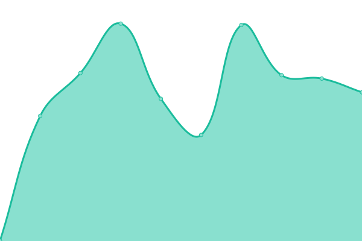

# [📈 Live Status](https://safe-global.github.io/safe-services-status): <!--live status--> **🟩 All systems operational**

This repository contains the open-source uptime monitor and status page for [Safe Ecosystem Foundation Backend](https://safe.global), powered by [Upptime](https://github.com/upptime/upptime).

With [Upptime](https://upptime.js.org), you can get your own unlimited and free uptime monitor and status page, powered entirely by a GitHub repository. We use [Issues](https://github.com/safe-global/safe-services-status/issues) as incident reports, [Actions](https://github.com/safe-global/safe-services-status/actions) as uptime monitors, and [Pages](https://safe-global.github.io/safe-services-status) for the status page.

<!--start: status pages-->
<!-- This summary is generated by Upptime (https://github.com/upptime/upptime) -->
<!-- Do not edit this manually, your changes will be overwritten -->
<!-- prettier-ignore -->
| URL | Status | History | Response Time | Uptime |
| --- | ------ | ------- | ------------- | ------ |
|  [Safe Client Gateway (Unified)](https://safe-client.safe.global/health/ready/) | 🟩 Up | [safe-client-gateway-unified.yml](https://github.com/safe-global/safe-services-status/commits/HEAD/history/safe-client-gateway-unified.yml) | 

 427ms
     
 | 

<a href="https://status.safe.global/history/safe-client-gateway-unified">100.00%</a>
    

|  [Safe Tx Service (Mainnet)](https://safe-transaction-mainnet.safe.global/check/) | 🟩 Up | [safe-tx-service-mainnet.yml](https://github.com/safe-global/safe-services-status/commits/HEAD/history/safe-tx-service-mainnet.yml) | 

 413ms
     
 | 

<a href="https://status.safe.global/history/safe-tx-service-mainnet">100.00%</a>
    

|  [Safe Tx Service (Gnosis Chain)](https://safe-transaction-gnosis-chain.safe.global/check/) | 🟩 Up | [safe-tx-service-gnosis-chain.yml](https://github.com/safe-global/safe-services-status/commits/HEAD/history/safe-tx-service-gnosis-chain.yml) | 

 440ms
     
 | 

<a href="https://status.safe.global/history/safe-tx-service-gnosis-chain">100.00%</a>
    

|  [Safe Tx Service (Goerli)](https://safe-transaction-goerli.safe.global/check/) | 🟩 Up | [safe-tx-service-goerli.yml](https://github.com/safe-global/safe-services-status/commits/HEAD/history/safe-tx-service-goerli.yml) | 

 485ms
     
 | 

<a href="https://status.safe.global/history/safe-tx-service-goerli">100.00%</a>
    

|  [Safe Tx Service (Binance Smart Chain)](https://safe-transaction-bsc.safe.global/check/) | 🟩 Up | [safe-tx-service-binance-smart-chain.yml](https://github.com/safe-global/safe-services-status/commits/HEAD/history/safe-tx-service-binance-smart-chain.yml) | 

 480ms
     
 | 

<a href="https://status.safe.global/history/safe-tx-service-binance-smart-chain">100.00%</a>
    

|  [Safe Tx Service (Polygon - Matic)](https://safe-transaction-polygon.safe.global/check/) | 🟩 Up | [safe-tx-service-polygon-matic.yml](https://github.com/safe-global/safe-services-status/commits/HEAD/history/safe-tx-service-polygon-matic.yml) | 

 479ms
     
 | 

<a href="https://status.safe.global/history/safe-tx-service-polygon-matic">100.00%</a>
    

|  [Safe Tx Service (Base Testnet)](https://safe-transaction-base-testnet.safe.global/check/) | 🟩 Up | [safe-tx-service-base-testnet.yml](https://github.com/safe-global/safe-services-status/commits/HEAD/history/safe-tx-service-base-testnet.yml) | 

 453ms
     
 | 

<a href="https://status.safe.global/history/safe-tx-service-base-testnet">100.00%</a>
    

|  [Safe Tx Service (Celo)](https://safe-transaction-celo.safe.global/check/) | 🟩 Up | [safe-tx-service-celo.yml](https://github.com/safe-global/safe-services-status/commits/HEAD/history/safe-tx-service-celo.yml) | 

 406ms
     
 | 

<a href="https://status.safe.global/history/safe-tx-service-celo">100.00%</a>
    

|  [Safe Tx Service (Arbitrum)](https://safe-transaction-arbitrum.safe.global/check/) | 🟩 Up | [safe-tx-service-arbitrum.yml](https://github.com/safe-global/safe-services-status/commits/HEAD/history/safe-tx-service-arbitrum.yml) | 

 450ms
     
 | 

<a href="https://status.safe.global/history/safe-tx-service-arbitrum">100.00%</a>
    

|  [Safe Tx Service (Avalanche)](https://safe-transaction-avalanche.safe.global/check/) | 🟩 Up | [safe-tx-service-avalanche.yml](https://github.com/safe-global/safe-services-status/commits/HEAD/history/safe-tx-service-avalanche.yml) | 

 419ms
     
 | 

<a href="https://status.safe.global/history/safe-tx-service-avalanche">100.00%</a>
    

|  [Safe Tx Service (Optimism)](https://safe-transaction-optimism.safe.global/check/) | 🟩 Up | [safe-tx-service-optimism.yml](https://github.com/safe-global/safe-services-status/commits/HEAD/history/safe-tx-service-optimism.yml) | 

 488ms
     
 | 

<a href="https://status.safe.global/history/safe-tx-service-optimism">100.00%</a>
    

<!--end: status pages-->

[**Visit our status website →**](https://safe-global.github.io/safe-services-status)

## 📄 License

- Powered by: [Upptime](https://github.com/upptime/upptime)
- Code: [MIT](./LICENSE) © [Safe Ecosystem Foundation](https://safe.global)
- Data in the `./history` directory: [Open Database License](https://opendatacommons.org/licenses/odbl/1-0/)
