# [📈 Live Status](https://safe-global.github.io/safe-services-status): <!--live status--> **🟩 All systems operational**

This repository contains the open-source uptime monitor and status page for [Safe Ecosystem Foundation Backend](https://safe.global), powered by [Upptime](https://github.com/upptime/upptime).

With [Upptime](https://upptime.js.org), you can get your own unlimited and free uptime monitor and status page, powered entirely by a GitHub repository. We use [Issues](https://github.com/safe-global/safe-services-status/issues) as incident reports, [Actions](https://github.com/safe-global/safe-services-status/actions) as uptime monitors, and [Pages](https://safe-global.github.io/safe-services-status) for the status page.

<!--start: status pages-->
<!-- This summary is generated by Upptime (https://github.com/upptime/upptime) -->
<!-- Do not edit this manually, your changes will be overwritten -->
<!-- prettier-ignore -->
| URL | Status | History | Response Time | Uptime |
| --- | ------ | ------- | ------------- | ------ |
|  [Safe Client Gateway](https://safe-client.safe.global/health/ready/) | 🟩 Up | [safe-client-gateway.yml](https://github.com/safe-global/safe-services-status/commits/HEAD/history/safe-client-gateway.yml) | 

 196ms
     
 | 

<a href="https://uptime.safe.global/history/safe-client-gateway">100.00%</a>
    

|  [Safe Tx Service (Mainnet)](https://safe-transaction-mainnet.safe.global/check/) | 🟩 Up | [safe-tx-service-mainnet.yml](https://github.com/safe-global/safe-services-status/commits/HEAD/history/safe-tx-service-mainnet.yml) | 

 337ms
     
 | 

<a href="https://uptime.safe.global/history/safe-tx-service-mainnet">95.37%</a>
    

|  [Safe Tx Service (Gnosis Chain)](https://safe-transaction-gnosis-chain.safe.global/check/) | 🟩 Up | [safe-tx-service-gnosis-chain.yml](https://github.com/safe-global/safe-services-status/commits/HEAD/history/safe-tx-service-gnosis-chain.yml) | 

 340ms
     
 | 

<a href="https://uptime.safe.global/history/safe-tx-service-gnosis-chain">95.39%</a>
    

|  [Safe Tx Service (Sepolia)](https://safe-transaction-sepolia.safe.global/check/) | 🟩 Up | [safe-tx-service-sepolia.yml](https://github.com/safe-global/safe-services-status/commits/HEAD/history/safe-tx-service-sepolia.yml) | 

 324ms
     
 | 

<a href="https://uptime.safe.global/history/safe-tx-service-sepolia">95.40%</a>
    

|  [Safe Tx Service (Binance Smart Chain)](https://safe-transaction-bsc.safe.global/check/) | 🟩 Up | [safe-tx-service-binance-smart-chain.yml](https://github.com/safe-global/safe-services-status/commits/HEAD/history/safe-tx-service-binance-smart-chain.yml) | 

 338ms
     
 | 

<a href="https://uptime.safe.global/history/safe-tx-service-binance-smart-chain">95.41%</a>
    

|  [Safe Tx Service (Polygon - Matic)](https://safe-transaction-polygon.safe.global/check/) | 🟩 Up | [safe-tx-service-polygon-matic.yml](https://github.com/safe-global/safe-services-status/commits/HEAD/history/safe-tx-service-polygon-matic.yml) | 

 338ms
     
 | 

<a href="https://uptime.safe.global/history/safe-tx-service-polygon-matic">95.43%</a>
    

|  [Safe Tx Service (Polygon - zkEVM)](https://safe-transaction-zkevm.safe.global/check/) | 🟩 Up | [safe-tx-service-polygon-zk-evm.yml](https://github.com/safe-global/safe-services-status/commits/HEAD/history/safe-tx-service-polygon-zk-evm.yml) | 

 321ms
     
 | 

<a href="https://uptime.safe.global/history/safe-tx-service-polygon-zk-evm">95.44%</a>
    

|  [Safe Tx Service (Base Mainnet)](https://safe-transaction-base.safe.global/check/) | 🟩 Up | [safe-tx-service-base-mainnet.yml](https://github.com/safe-global/safe-services-status/commits/HEAD/history/safe-tx-service-base-mainnet.yml) | 

 331ms
     
 | 

<a href="https://uptime.safe.global/history/safe-tx-service-base-mainnet">95.45%</a>
    

|  [Safe Tx Service (Base Sepolia)](https://safe-transaction-base-sepolia.safe.global/check/) | 🟩 Up | [safe-tx-service-base-sepolia.yml](https://github.com/safe-global/safe-services-status/commits/HEAD/history/safe-tx-service-base-sepolia.yml) | 

 299ms
     
 | 

<a href="https://uptime.safe.global/history/safe-tx-service-base-sepolia">95.47%</a>
    

|  [Safe Tx Service (Celo)](https://safe-transaction-celo.safe.global/check/) | 🟩 Up | [safe-tx-service-celo.yml](https://github.com/safe-global/safe-services-status/commits/HEAD/history/safe-tx-service-celo.yml) | 

 314ms
     
 | 

<a href="https://uptime.safe.global/history/safe-tx-service-celo">95.48%</a>
    

|  [Safe Tx Service (Arbitrum)](https://safe-transaction-arbitrum.safe.global/check/) | 🟩 Up | [safe-tx-service-arbitrum.yml](https://github.com/safe-global/safe-services-status/commits/HEAD/history/safe-tx-service-arbitrum.yml) | 

 307ms
     
 | 

<a href="https://uptime.safe.global/history/safe-tx-service-arbitrum">95.49%</a>
    

|  [Safe Tx Service (Avalanche)](https://safe-transaction-avalanche.safe.global/check/) | 🟩 Up | [safe-tx-service-avalanche.yml](https://github.com/safe-global/safe-services-status/commits/HEAD/history/safe-tx-service-avalanche.yml) | 

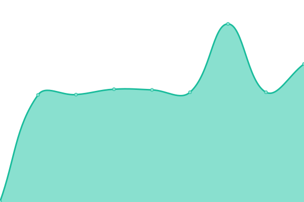 317ms
     
 | 

<a href="https://uptime.safe.global/history/safe-tx-service-avalanche">95.51%</a>
    

|  [Safe Tx Service (Optimism)](https://safe-transaction-optimism.safe.global/check/) | 🟩 Up | [safe-tx-service-optimism.yml](https://github.com/safe-global/safe-services-status/commits/HEAD/history/safe-tx-service-optimism.yml) | 

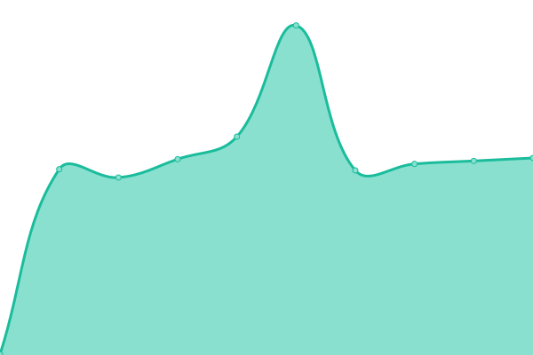 315ms
     
 | 

<a href="https://uptime.safe.global/history/safe-tx-service-optimism">95.52%</a>
    

|  [Safe Tx Service (Aurora)](https://safe-transaction-aurora.safe.global/check/) | 🟩 Up | [safe-tx-service-aurora.yml](https://github.com/safe-global/safe-services-status/commits/HEAD/history/safe-tx-service-aurora.yml) | 

 299ms
     
 | 

<a href="https://uptime.safe.global/history/safe-tx-service-aurora">95.53%</a>
    

|  [Safe Tx Service (zkSync Era Mainnet)](https://safe-transaction-zksync.safe.global/check/) | 🟩 Up | [safe-tx-service-zk-sync-era-mainnet.yml](https://github.com/safe-global/safe-services-status/commits/HEAD/history/safe-tx-service-zk-sync-era-mainnet.yml) | 

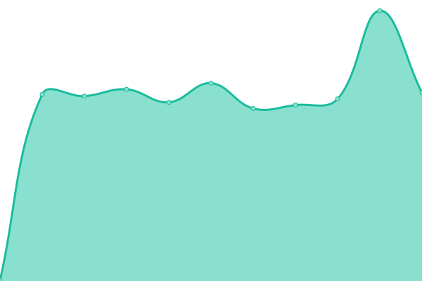 306ms
     
 | 

<a href="https://uptime.safe.global/history/safe-tx-service-zk-sync-era-mainnet">95.54%</a>
    

|  [Safe Tx Service (xLayer)](https://safe-transaction-xlayer.safe.global/check/) | 🟩 Up | [safe-tx-service-x-layer.yml](https://github.com/safe-global/safe-services-status/commits/HEAD/history/safe-tx-service-x-layer.yml) | 

 324ms
     
 | 

<a href="https://uptime.safe.global/history/safe-tx-service-x-layer">95.56%</a>
    

|  [Safe Tx Service (Scroll)](https://safe-transaction-scroll.safe.global/check/) | 🟩 Up | [safe-tx-service-scroll.yml](https://github.com/safe-global/safe-services-status/commits/HEAD/history/safe-tx-service-scroll.yml) | 

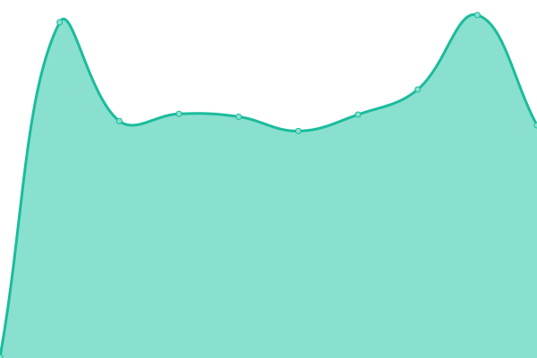 330ms
     
 | 

<a href="https://uptime.safe.global/history/safe-tx-service-scroll">95.57%</a>
    

|  [Safe Tx Service (Linea)](https://safe-transaction-linea.safe.global/check/) | 🟩 Up | [safe-tx-service-linea.yml](https://github.com/safe-global/safe-services-status/commits/HEAD/history/safe-tx-service-linea.yml) | 

 316ms
     
 | 

<a href="https://uptime.safe.global/history/safe-tx-service-linea">95.58%</a>
    

|  [Safe Tx Service (Chiado)](https://safe-transaction-chiado.safe.global/check/) | 🟩 Up | [safe-tx-service-chiado.yml](https://github.com/safe-global/safe-services-status/commits/HEAD/history/safe-tx-service-chiado.yml) | 

 315ms
     
 | 

<a href="https://uptime.safe.global/history/safe-tx-service-chiado">95.60%</a>
    

|  [Safe Tx Service (Mantle)](https://safe-transaction-mantle.safe.global/check/) | 🟩 Up | [safe-tx-service-mantle.yml](https://github.com/safe-global/safe-services-status/commits/HEAD/history/safe-tx-service-mantle.yml) | 

 306ms
     
 | 

<a href="https://uptime.safe.global/history/safe-tx-service-mantle">95.61%</a>
    

|  [Safe Tx Service (Sonic)](https://safe-transaction-sonic.safe.global/check/) | 🟩 Up | [safe-tx-service-sonic.yml](https://github.com/safe-global/safe-services-status/commits/HEAD/history/safe-tx-service-sonic.yml) | 

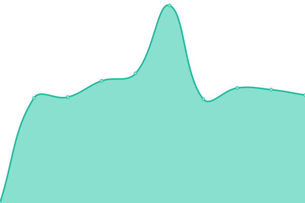 311ms
     
 | 

<a href="https://uptime.safe.global/history/safe-tx-service-sonic">95.62%</a>
    

|  [Safe Tx Service (Ink)](https://safe-transaction-ink.safe.global/check/) | 🟩 Up | [safe-tx-service-ink.yml](https://github.com/safe-global/safe-services-status/commits/HEAD/history/safe-tx-service-ink.yml) | 

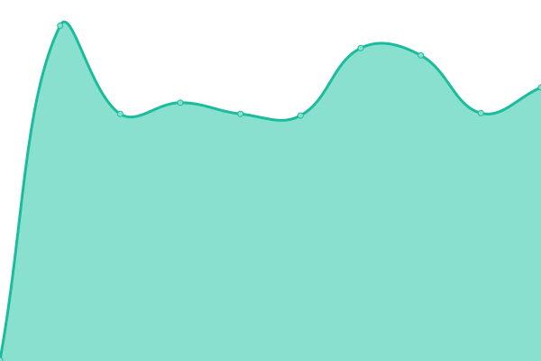 312ms
     
 | 

<a href="https://uptime.safe.global/history/safe-tx-service-ink">95.64%</a>
    

|  [Safe Tx Service (Unichain)](https://safe-transaction-unichain.safe.global/check/) | 🟩 Up | [safe-tx-service-unichain.yml](https://github.com/safe-global/safe-services-status/commits/HEAD/history/safe-tx-service-unichain.yml) | 

 303ms
     
 | 

<a href="https://uptime.safe.global/history/safe-tx-service-unichain">95.65%</a>
    

|  [Safe Tx Service (Berachain)](https://safe-transaction-berachain.safe.global/check/) | 🟩 Up | [safe-tx-service-berachain.yml](https://github.com/safe-global/safe-services-status/commits/HEAD/history/safe-tx-service-berachain.yml) | 

 296ms
     
 | 

<a href="https://uptime.safe.global/history/safe-tx-service-berachain">95.66%</a>
    

|  [Safe Tx Service (Lens)](https://safe-transaction-lens.safe.global/check/) | 🟩 Up | [safe-tx-service-lens.yml](https://github.com/safe-global/safe-services-status/commits/HEAD/history/safe-tx-service-lens.yml) | 

 329ms
     
 | 

<a href="https://uptime.safe.global/history/safe-tx-service-lens">95.68%</a>
    

|  [Safe Tx Service (Hemi)](https://safe-transaction-hemi.safe.global/check/) | 🟩 Up | [safe-tx-service-hemi.yml](https://github.com/safe-global/safe-services-status/commits/HEAD/history/safe-tx-service-hemi.yml) | 

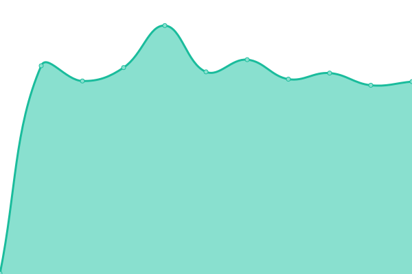 309ms
     
 | 

<a href="https://uptime.safe.global/history/safe-tx-service-hemi">95.69%</a>
    

|  [Safe Tx Service (Katana)](https://safe-transaction-katana.safe.global/check/) | 🟩 Up | [safe-tx-service-katana.yml](https://github.com/safe-global/safe-services-status/commits/HEAD/history/safe-tx-service-katana.yml) | 

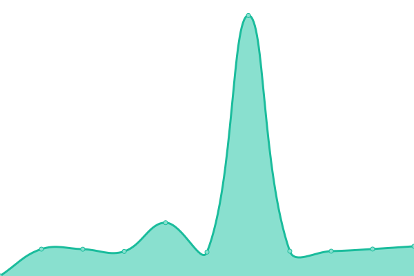 299ms
     
 | 

<a href="https://uptime.safe.global/history/safe-tx-service-katana">95.70%</a>
    

|  [Safe Tx Service (Peaq)](https://safe-transaction-peaq.safe.global/check/) | 🟩 Up | [safe-tx-service-peaq.yml](https://github.com/safe-global/safe-services-status/commits/HEAD/history/safe-tx-service-peaq.yml) | 

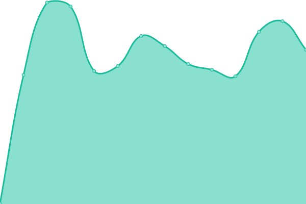 308ms
     
 | 

<a href="https://uptime.safe.global/history/safe-tx-service-peaq">95.72%</a>
    

|  [Safe Tx Service (Codex)](https://safe-transaction-codex.safe.global/check/) | 🟩 Up | [safe-tx-service-codex.yml](https://github.com/safe-global/safe-services-status/commits/HEAD/history/safe-tx-service-codex.yml) | 

 306ms
     
 | 

<a href="https://uptime.safe.global/history/safe-tx-service-codex">95.73%</a>
    

|  [Safe Tx Service (Monad)](https://safe-transaction-monad.safe.global/check/) | 🟩 Up | [safe-tx-service-monad.yml](https://github.com/safe-global/safe-services-status/commits/HEAD/history/safe-tx-service-monad.yml) | 

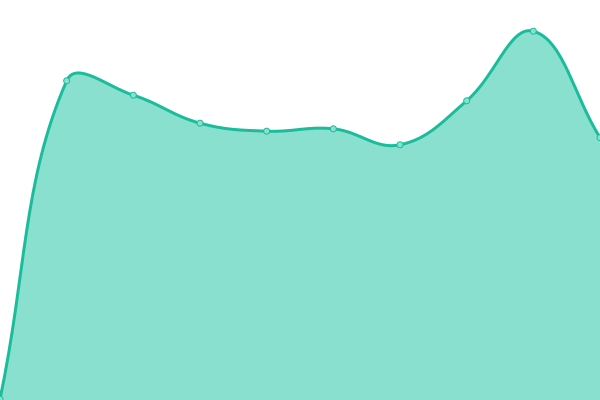 304ms
     
 | 

<a href="https://uptime.safe.global/history/safe-tx-service-monad">95.74%</a>
    

|  [Safe Tx Service (OpBNB)](https://safe-transaction-opbnb.safe.global/check/) | 🟩 Up | [safe-tx-service-op-bnb.yml](https://github.com/safe-global/safe-services-status/commits/HEAD/history/safe-tx-service-op-bnb.yml) | 

 297ms
     
 | 

<a href="https://uptime.safe.global/history/safe-tx-service-op-bnb">95.75%</a>
    

|  [Safe Tx Service (Botanix)](https://safe-transaction-botanix.safe.global/check/) | 🟩 Up | [safe-tx-service-botanix.yml](https://github.com/safe-global/safe-services-status/commits/HEAD/history/safe-tx-service-botanix.yml) | 

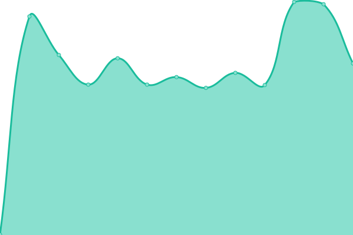 298ms
     
 | 

<a href="https://uptime.safe.global/history/safe-tx-service-botanix">95.77%</a>
    

|  [Safe Tx Service (XDC)](https://safe-transaction-xdc.safe.global/check/) | 🟩 Up | [safe-tx-service-xdc.yml](https://github.com/safe-global/safe-services-status/commits/HEAD/history/safe-tx-service-xdc.yml) | 

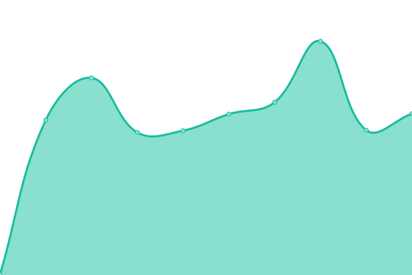 311ms
     
 | 

<a href="https://uptime.safe.global/history/safe-tx-service-xdc">95.78%</a>
    

|  [Safe Tx Service (Plasma)](https://api.safe.global/tx-service/plasma/check/) | 🟩 Up | [safe-tx-service-plasma.yml](https://github.com/safe-global/safe-services-status/commits/HEAD/history/safe-tx-service-plasma.yml) | 

 235ms
     
 | 

<a href="https://uptime.safe.global/history/safe-tx-service-plasma">95.79%</a>
    

|  [Safe Tx Service (0g)](https://api.safe.global/tx-service/0g/check/) | 🟩 Up | [safe-tx-service-0g.yml](https://github.com/safe-global/safe-services-status/commits/HEAD/history/safe-tx-service-0g.yml) | 

 468ms
     
 | 

<a href="https://uptime.safe.global/history/safe-tx-service-0g">95.81%</a>
    

|  [Safe Tx Service (Stable)](https://api.safe.global/tx-service/stable/check/) | 🟩 Up | [safe-tx-service-stable.yml](https://github.com/safe-global/safe-services-status/commits/HEAD/history/safe-tx-service-stable.yml) | 

 237ms
     
 | 

<a href="https://uptime.safe.global/history/safe-tx-service-stable">95.82%</a>
    

|  [Safe Tx Service (Monad Testnet)](https://api.safe.global/tx-service/monad-testnet/check/) | 🟩 Up | [safe-tx-service-monad-testnet.yml](https://github.com/safe-global/safe-services-status/commits/HEAD/history/safe-tx-service-monad-testnet.yml) | 

 229ms
     
 | 

<a href="https://uptime.safe.global/history/safe-tx-service-monad-testnet">95.83%</a>
    

|  [Safe Tx Service (HyperEvm)](https://api.safe.global/tx-service/hyper/check/) | 🟩 Up | [safe-tx-service-hyper-evm.yml](https://github.com/safe-global/safe-services-status/commits/HEAD/history/safe-tx-service-hyper-evm.yml) | 

 236ms
     
 | 

<a href="https://uptime.safe.global/history/safe-tx-service-hyper-evm">95.85%</a>
    

|  [Safe Tx Service (MegaEth)](https://api.safe.global/tx-service/mega/check/) | 🟩 Up | [safe-tx-service-mega-eth.yml](https://github.com/safe-global/safe-services-status/commits/HEAD/history/safe-tx-service-mega-eth.yml) | 

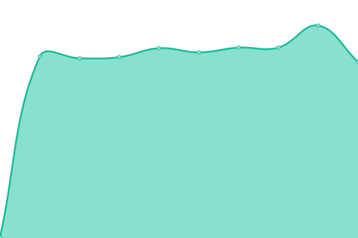 470ms
     
 | 

<a href="https://uptime.safe.global/history/safe-tx-service-mega-eth">95.86%</a>
    

|  [Safe Tx Service (Arc Testnet)](https://api.safe.global/tx-service/arc-testnet/check/) | 🟩 Up | [safe-tx-service-arc-testnet.yml](https://github.com/safe-global/safe-services-status/commits/HEAD/history/safe-tx-service-arc-testnet.yml) | 

 231ms
     
 | 

<a href="https://uptime.safe.global/history/safe-tx-service-arc-testnet">95.88%</a>
    

|  [Safe Tx Service (Creditcoin)](https://api.safe.global/tx-service/ctc/check/) | 🟩 Up | [safe-tx-service-creditcoin.yml](https://github.com/safe-global/safe-services-status/commits/HEAD/history/safe-tx-service-creditcoin.yml) | 

 230ms
     
 | 

<a href="https://uptime.safe.global/history/safe-tx-service-creditcoin">95.89%</a>
    

|  [Safe Tx Service (Mantle Sepolia)](https://api.safe.global/tx-service/mnt-sep/check/) | 🟩 Up | [safe-tx-service-mantle-sepolia.yml](https://github.com/safe-global/safe-services-status/commits/HEAD/history/safe-tx-service-mantle-sepolia.yml) | 

 227ms
     
 | 

<a href="https://uptime.safe.global/history/safe-tx-service-mantle-sepolia">95.90%</a>
    

|  [Safe Tx Service (Tempo Moderato)](https://api.safe.global/tx-service/tempo-moderato/check/) | 🟩 Up | [safe-tx-service-tempo-moderato.yml](https://github.com/safe-global/safe-services-status/commits/HEAD/history/safe-tx-service-tempo-moderato.yml) | 

 234ms
     
 | 

<a href="https://uptime.safe.global/history/safe-tx-service-tempo-moderato">95.91%</a>
    

|  [Safe Tx Service (Tempo)](https://api.safe.global/tx-service/tempo/check/) | 🟩 Up | [safe-tx-service-tempo.yml](https://github.com/safe-global/safe-services-status/commits/HEAD/history/safe-tx-service-tempo.yml) | 

 231ms
     
 | 

<a href="https://uptime.safe.global/history/safe-tx-service-tempo">95.93%</a>
    

|  [Safe Tx Service (Fluent)](https://api.safe.global/tx-service/fluent/check/) | 🟩 Up | [safe-tx-service-fluent.yml](https://github.com/safe-global/safe-services-status/commits/HEAD/history/safe-tx-service-fluent.yml) | 

 230ms
     
 | 

<a href="https://uptime.safe.global/history/safe-tx-service-fluent">95.94%</a>
    

|  [Safe Tx Service (Robinhood Testnet)](https://api.safe.global/tx-service/robinhood-testnet/check/) | 🟩 Up | [safe-tx-service-robinhood-testnet.yml](https://github.com/safe-global/safe-services-status/commits/HEAD/history/safe-tx-service-robinhood-testnet.yml) | 

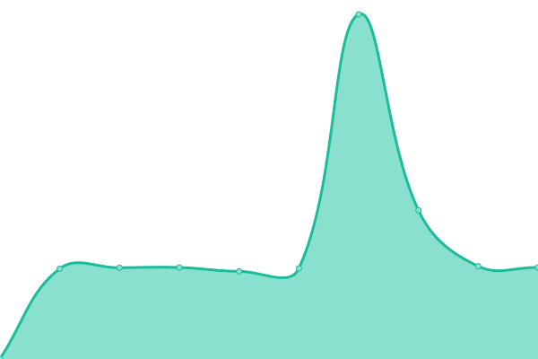 237ms
     
 | 

<a href="https://uptime.safe.global/history/safe-tx-service-robinhood-testnet">95.95%</a>
    

|  [Safe Tx Service (Pharos)](https://api.safe.global/tx-service/pharos/check/) | 🟩 Up | [safe-tx-service-pharos.yml](https://github.com/safe-global/safe-services-status/commits/HEAD/history/safe-tx-service-pharos.yml) | 

 233ms
     
 | 

<a href="https://uptime.safe.global/history/safe-tx-service-pharos">95.97%</a>
    

|  [Safe Tx Service (Celo  Sepolia)](https://api.safe.global/tx-service/celo-sep/check/) | 🟩 Up | [safe-tx-service-celo-sepolia.yml](https://github.com/safe-global/safe-services-status/commits/HEAD/history/safe-tx-service-celo-sepolia.yml) | 

 238ms
     
 | 

<a href="https://uptime.safe.global/history/safe-tx-service-celo-sepolia">95.98%</a>
    

|  [Safe Tx Service (Arc)](https://api.safe.global/tx-service/arc/check/) | 🟩 Up | [safe-tx-service-arc.yml](https://github.com/safe-global/safe-services-status/commits/HEAD/history/safe-tx-service-arc.yml) | 

 222ms
     
 | 

<a href="https://uptime.safe.global/history/safe-tx-service-arc">95.99%</a>
    

|  [Safe Tx Service (Aetherium)](https://api.safe.global/tx-service/aeth/check/) | 🟩 Up | [safe-tx-service-aetherium.yml](https://github.com/safe-global/safe-services-status/commits/HEAD/history/safe-tx-service-aetherium.yml) | 

 230ms
     
 | 

<a href="https://uptime.safe.global/history/safe-tx-service-aetherium">96.01%</a>
    

|  [Safe Tx Service (Kairos)](https://api.safe.global/tx-service/kairos/check/) | 🟩 Up | [safe-tx-service-kairos.yml](https://github.com/safe-global/safe-services-status/commits/HEAD/history/safe-tx-service-kairos.yml) | 

 230ms
     
 | 

<a href="https://uptime.safe.global/history/safe-tx-service-kairos">96.02%</a>
    

|  [Safe Tx Service (Kaia)](https://api.safe.global/tx-service/kaia/check/) | 🟩 Up | [safe-tx-service-kaia.yml](https://github.com/safe-global/safe-services-status/commits/HEAD/history/safe-tx-service-kaia.yml) | 

 185ms
     
 | 

<a href="https://uptime.safe.global/history/safe-tx-service-kaia">92.73%</a>
    

<!--end: status pages-->

[**Visit our status website →**](https://safe-global.github.io/safe-services-status)

## 📄 License

- Powered by: [Upptime](https://github.com/upptime/upptime)
- Code: [MIT](./LICENSE) © [Safe Ecosystem Foundation](https://safe.global)
- Data in the `./history` directory: [Open Database License](https://opendatacommons.org/licenses/odbl/1-0/)
