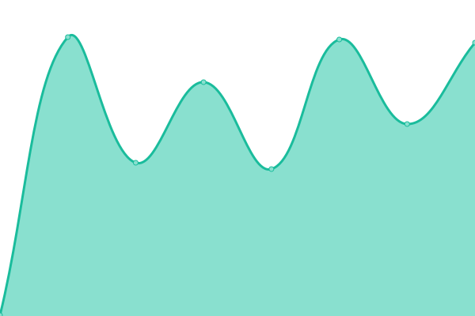
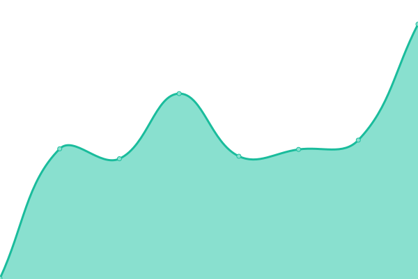
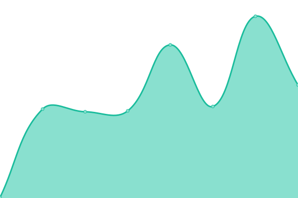

# [📈 Live Status](https://safe-global.github.io/safe-services-status): <!--live status--> **🟧 Partial outage**

This repository contains the open-source uptime monitor and status page for [Safe Ecosystem Foundation Backend](https://safe.global), powered by [Upptime](https://github.com/upptime/upptime).

With [Upptime](https://upptime.js.org), you can get your own unlimited and free uptime monitor and status page, powered entirely by a GitHub repository. We use [Issues](https://github.com/safe-global/safe-services-status/issues) as incident reports, [Actions](https://github.com/safe-global/safe-services-status/actions) as uptime monitors, and [Pages](https://safe-global.github.io/safe-services-status) for the status page.

<!--start: status pages-->
<!-- This summary is generated by Upptime (https://github.com/upptime/upptime) -->
<!-- Do not edit this manually, your changes will be overwritten -->
<!-- prettier-ignore -->
| URL | Status | History | Response Time | Uptime |
| --- | ------ | ------- | ------------- | ------ |
|  [Safe Client Gateway](https://safe-client.safe.global/health/ready/) | 🟩 Up | [safe-client-gateway.yml](https://github.com/safe-global/safe-services-status/commits/HEAD/history/safe-client-gateway.yml) | 

 368ms
     
 | 

<a href="https://uptime.safe.global/history/safe-client-gateway">98.40%</a>
    

|  [Safe Tx Service (Mainnet)](https://safe-transaction-mainnet.safe.global/check/) | 🟩 Up | [safe-tx-service-mainnet.yml](https://github.com/safe-global/safe-services-status/commits/HEAD/history/safe-tx-service-mainnet.yml) | 

 436ms
     
 | 

<a href="https://uptime.safe.global/history/safe-tx-service-mainnet">97.89%</a>
    

|  [Safe Tx Service (Gnosis Chain)](https://safe-transaction-gnosis-chain.safe.global/check/) | 🟩 Up | [safe-tx-service-gnosis-chain.yml](https://github.com/safe-global/safe-services-status/commits/HEAD/history/safe-tx-service-gnosis-chain.yml) | 

 284ms
     
 | 

<a href="https://uptime.safe.global/history/safe-tx-service-gnosis-chain">97.49%</a>
    

|  [Safe Tx Service (Sepolia)](https://safe-transaction-sepolia.safe.global/check/) | 🟩 Up | [safe-tx-service-sepolia.yml](https://github.com/safe-global/safe-services-status/commits/HEAD/history/safe-tx-service-sepolia.yml) | 

 240ms
     
 | 

<a href="https://uptime.safe.global/history/safe-tx-service-sepolia">98.46%</a>
    

|  [Safe Tx Service (Binance Smart Chain)](https://safe-transaction-bsc.safe.global/check/) | 🟩 Up | [safe-tx-service-binance-smart-chain.yml](https://github.com/safe-global/safe-services-status/commits/HEAD/history/safe-tx-service-binance-smart-chain.yml) | 

 271ms
     
 | 

<a href="https://uptime.safe.global/history/safe-tx-service-binance-smart-chain">97.55%</a>
    

|  [Safe Tx Service (Polygon - Matic)](https://safe-transaction-polygon.safe.global/check/) | 🟩 Up | [safe-tx-service-polygon-matic.yml](https://github.com/safe-global/safe-services-status/commits/HEAD/history/safe-tx-service-polygon-matic.yml) | 

 247ms
     
 | 

<a href="https://uptime.safe.global/history/safe-tx-service-polygon-matic">97.42%</a>
    

|  [Safe Tx Service (Polygon - zkEVM)](https://safe-transaction-zkevm.safe.global/check/) | 🟩 Up | [safe-tx-service-polygon-zk-evm.yml](https://github.com/safe-global/safe-services-status/commits/HEAD/history/safe-tx-service-polygon-zk-evm.yml) | 

 407ms
     
 | 

<a href="https://uptime.safe.global/history/safe-tx-service-polygon-zk-evm">97.42%</a>
    

|  [Safe Tx Service (Base Mainnet)](https://safe-transaction-base.safe.global/check/) | 🟩 Up | [safe-tx-service-base-mainnet.yml](https://github.com/safe-global/safe-services-status/commits/HEAD/history/safe-tx-service-base-mainnet.yml) | 

 215ms
     
 | 

<a href="https://uptime.safe.global/history/safe-tx-service-base-mainnet">97.55%</a>
    

|  [Safe Tx Service (Base Sepolia)](https://safe-transaction-base-sepolia.safe.global/check/) | 🟩 Up | [safe-tx-service-base-sepolia.yml](https://github.com/safe-global/safe-services-status/commits/HEAD/history/safe-tx-service-base-sepolia.yml) | 

 226ms
     
 | 

<a href="https://uptime.safe.global/history/safe-tx-service-base-sepolia">97.55%</a>
    

|  [Safe Tx Service (Celo)](https://safe-transaction-celo.safe.global/check/) | 🟩 Up | [safe-tx-service-celo.yml](https://github.com/safe-global/safe-services-status/commits/HEAD/history/safe-tx-service-celo.yml) | 

 242ms
     
 | 

<a href="https://uptime.safe.global/history/safe-tx-service-celo">97.55%</a>
    

|  [Safe Tx Service (Arbitrum)](https://safe-transaction-arbitrum.safe.global/check/) | 🟩 Up | [safe-tx-service-arbitrum.yml](https://github.com/safe-global/safe-services-status/commits/HEAD/history/safe-tx-service-arbitrum.yml) | 

 239ms
     
 | 

<a href="https://uptime.safe.global/history/safe-tx-service-arbitrum">97.79%</a>
    

|  [Safe Tx Service (Avalanche)](https://safe-transaction-avalanche.safe.global/check/) | 🟩 Up | [safe-tx-service-avalanche.yml](https://github.com/safe-global/safe-services-status/commits/HEAD/history/safe-tx-service-avalanche.yml) | 

 301ms
     
 | 

<a href="https://uptime.safe.global/history/safe-tx-service-avalanche">97.45%</a>
    

|  [Safe Tx Service (Optimism)](https://safe-transaction-optimism.safe.global/check/) | 🟩 Up | [safe-tx-service-optimism.yml](https://github.com/safe-global/safe-services-status/commits/HEAD/history/safe-tx-service-optimism.yml) | 

 263ms
     
 | 

<a href="https://uptime.safe.global/history/safe-tx-service-optimism">97.48%</a>
    

|  [Safe Tx Service (Aurora)](https://safe-transaction-aurora.safe.global/check/) | 🟩 Up | [safe-tx-service-aurora.yml](https://github.com/safe-global/safe-services-status/commits/HEAD/history/safe-tx-service-aurora.yml) | 

 215ms
     
 | 

<a href="https://uptime.safe.global/history/safe-tx-service-aurora">97.69%</a>
    

|  [Safe Tx Service (zkSync Era Mainnet)](https://safe-transaction-zksync.safe.global/check/) | 🟩 Up | [safe-tx-service-zk-sync-era-mainnet.yml](https://github.com/safe-global/safe-services-status/commits/HEAD/history/safe-tx-service-zk-sync-era-mainnet.yml) | 

 219ms
     
 | 

<a href="https://uptime.safe.global/history/safe-tx-service-zk-sync-era-mainnet">97.41%</a>
    

|  [Safe Tx Service (xLayer)](https://safe-transaction-xlayer.safe.global/check/) | 🟩 Up | [safe-tx-service-x-layer.yml](https://github.com/safe-global/safe-services-status/commits/HEAD/history/safe-tx-service-x-layer.yml) | 

 185ms
     
 | 

<a href="https://uptime.safe.global/history/safe-tx-service-x-layer">97.41%</a>
    

|  [Safe Tx Service (Scroll)](https://safe-transaction-scroll.safe.global/check/) | 🟩 Up | [safe-tx-service-scroll.yml](https://github.com/safe-global/safe-services-status/commits/HEAD/history/safe-tx-service-scroll.yml) | 

 255ms
     
 | 

<a href="https://uptime.safe.global/history/safe-tx-service-scroll">97.47%</a>
    

|  [Safe Tx Service (Linea)](https://safe-transaction-linea.safe.global/check/) | 🟩 Up | [safe-tx-service-linea.yml](https://github.com/safe-global/safe-services-status/commits/HEAD/history/safe-tx-service-linea.yml) | 

 247ms
     
 | 

<a href="https://uptime.safe.global/history/safe-tx-service-linea">97.47%</a>
    

|  [Safe Tx Service (Chiado)](https://safe-transaction-chiado.safe.global/check/) | 🟩 Up | [safe-tx-service-chiado.yml](https://github.com/safe-global/safe-services-status/commits/HEAD/history/safe-tx-service-chiado.yml) | 

 219ms
     
 | 

<a href="https://uptime.safe.global/history/safe-tx-service-chiado">97.54%</a>
    

|  [Safe Tx Service (Mantle)](https://safe-transaction-mantle.safe.global/check/) | 🟩 Up | [safe-tx-service-mantle.yml](https://github.com/safe-global/safe-services-status/commits/HEAD/history/safe-tx-service-mantle.yml) | 

 185ms
     
 | 

<a href="https://uptime.safe.global/history/safe-tx-service-mantle">97.47%</a>
    

|  [Safe Tx Service (Sonic)](https://safe-transaction-sonic.safe.global/check/) | 🟥 Down | [safe-tx-service-sonic.yml](https://github.com/safe-global/safe-services-status/commits/HEAD/history/safe-tx-service-sonic.yml) | 

 253ms
     
 | 

<a href="https://uptime.safe.global/history/safe-tx-service-sonic">97.46%</a>
    

|  [Safe Tx Service (Ink)](https://safe-transaction-ink.safe.global/check/) | 🟩 Up | [safe-tx-service-ink.yml](https://github.com/safe-global/safe-services-status/commits/HEAD/history/safe-tx-service-ink.yml) | 

 224ms
     
 | 

<a href="https://uptime.safe.global/history/safe-tx-service-ink">97.46%</a>
    

|  [Safe Tx Service (Unichain)](https://safe-transaction-unichain.safe.global/check/) | 🟩 Up | [safe-tx-service-unichain.yml](https://github.com/safe-global/safe-services-status/commits/HEAD/history/safe-tx-service-unichain.yml) | 

 212ms
     
 | 

<a href="https://uptime.safe.global/history/safe-tx-service-unichain">97.46%</a>
    

|  [Safe Tx Service (Berachain)](https://safe-transaction-berachain.safe.global/check/) | 🟩 Up | [safe-tx-service-berachain.yml](https://github.com/safe-global/safe-services-status/commits/HEAD/history/safe-tx-service-berachain.yml) | 

 240ms
     
 | 

<a href="https://uptime.safe.global/history/safe-tx-service-berachain">97.33%</a>
    

<!--end: status pages-->

[**Visit our status website →**](https://safe-global.github.io/safe-services-status)

## 📄 License

- Powered by: [Upptime](https://github.com/upptime/upptime)
- Code: [MIT](./LICENSE) © [Safe Ecosystem Foundation](https://safe.global)
- Data in the `./history` directory: [Open Database License](https://opendatacommons.org/licenses/odbl/1-0/)
